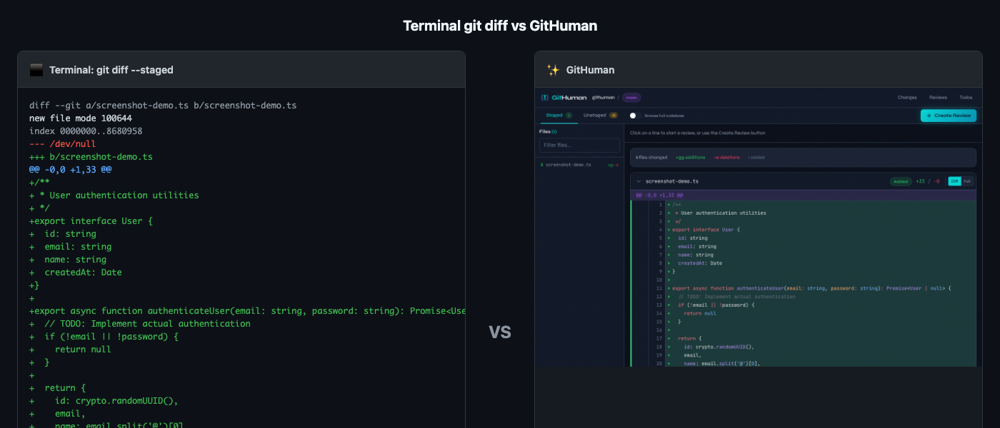

# Introducing GitHuman: Review AI-Generated Code Before You Commit

🌐 [githuman.dev](https://githuman.dev/) | 📦 [GitHub](https://github.com/mcollina/githuman)

---


**A local-first tool that moves the code review checkpoint from "after push" to "before commit"**

---

Like everyone else, I had to build something over the end-of-year break. This was my thing.

A few days ago, I wrote about [the human in the loop](https://adventures.nodeland.dev/archive/the-human-in-the-loop/) and why review is now the bottleneck in software development. GitHuman is that idea turned into a tool.

AI coding agents are transforming how we write software. Cursor, Copilot, Claude Code: they can generate hundreds of lines in seconds. But there's a problem: by the time you've pushed to a branch and opened a PR, you've already committed to an approach. The review happens too late.

GitHuman fixes this by moving the review to your staging area. Before `git commit`, not after `git push`.

## The Core Idea

Traditional code review was designed for human-to-human collaboration. You write code incrementally, push a branch, open a PR, and colleagues review thoughtfully constructed changes.

AI agents don't work this way. They generate code fast, faster than you can meaningfully review in a terminal diff. GitHuman gives you a proper interface to understand and approve AI-generated changes before they become part of your codebase.



## What You Get

- **GitHub-style diff viewer** with syntax highlighting (powered by Shiki)
- **Inline comments** with code suggestions
- **File-by-file navigation** with a familiar sidebar
- **Branch comparison** for reviewing changes between any two branches
- **Todo tracking** integrated with the CLI
- **Mobile-friendly** responsive design, so you can review code from your phone
- **Markdown export** for documentation
- **Real-time updates** via Server-Sent Events


Everything runs locally. No cloud services, no accounts, no data leaving your machine.

## How I Built It

Here's the twist: GitHuman was entirely written by Claude Code. Every line, every test, every CSS rule was AI-generated. But every commit was reviewed by a human using GitHuman itself.

From my phone, via SSH and Tailscale, I reviewed 83 commits over 12 days. The tight feedback loop caught real bugs that automated tests missed. If you can build an entire application by reviewing AI-generated code on mobile, the workflow works.

It's now a tool I use every day.

<!-- Optional: Add a real photo of mobile workflow setup for authenticity -->

## Get Started

```bash
cd /your/repo && npx githuman serve
```

Stage some changes, open the browser, and see your diff the way it deserves to be seen.

<video src="docs/screenshots/workflow-demo.webm" autoplay loop muted playsinline width="100%">
  Your browser does not support the video tag.
</video>

*Demo: Navigate staged changes, scroll through diffs, and create reviews.*

---

🌐 [githuman.dev](https://githuman.dev/)
📦 [github.com/mcollina/githuman](https://github.com/mcollina/githuman)

MIT licensed. Built with Claude Code, reviewed by a human.