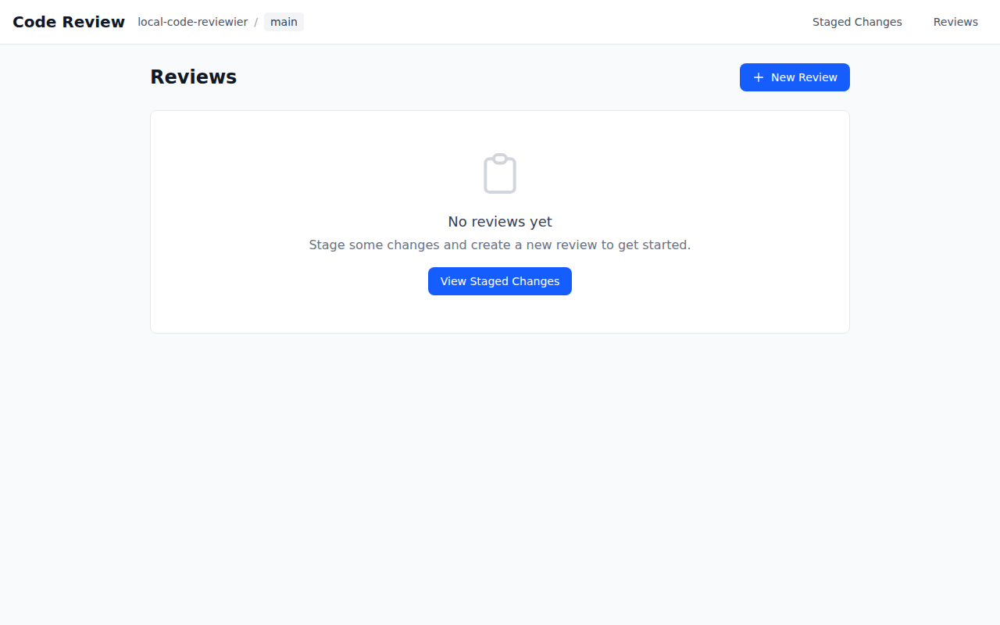
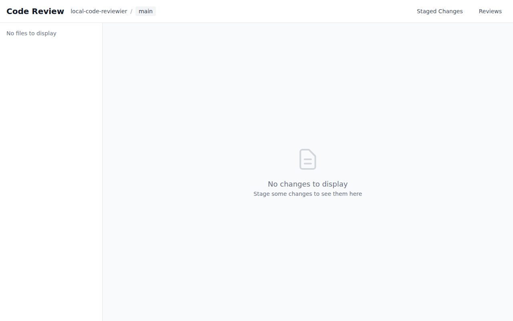

<p align="center">
  
</p>

# GitHuman

**Review AI agent code changes before commit.**

GitHub revolutionized how humans collaborate on code.

GitHuman defines how humans review code written by AI.

## The Problem

AI coding agents write code. But the traditional PR workflow assumes humans are the authors. By the time AI-generated code reaches a pull request, you've already committed to the approach. Review happens too late.

## The Solution

GitHuman moves the review checkpoint to where it belongs: **the staging area**.

Before `git commit`, you get a proper review interface—not a wall of terminal diff output. Add comments, track issues, and make informed decisions about what the AI produced.

## Screenshots

### Reviews List


### Staged Changes


## Features

- **Visual diff review** - Review staged changes in a clean, GitHub-like interface
- **Inline comments** - Add comments to specific lines with code suggestions
- **Review workflow** - Track status: in progress, approved, or changes requested
- **Todo tracking** - Create tasks for follow-up work via CLI or web interface
- **Markdown export** - Export reviews with comments for documentation
- **Keyboard shortcuts** - Navigate quickly with vim-style bindings
- **Local & private** - Everything runs on your machine, no data leaves

## Requirements

- Node.js 24.0.0 or higher

## Installation

```bash
npm install -g githuman
```

Or run directly:

```bash
npx githuman serve
```

## Quick Start

```bash
# Stage your changes (from AI agent or manual edits)
git add .

# Start the review interface
githuman serve
```

This opens a web interface at `http://localhost:3847` where you can review your staged changes before committing.

## Agent Skills

GitHuman provides an agent skill that teaches AI coding agents when and how to use GitHuman for reviewing changes.

Install it with the [skills](https://skills.sh/) CLI:

```bash
npx skills add mcollina/githuman-skills
```

## CLI Reference

### Start Review Server

```bash
githuman serve [options]

Options:
  -p, --port <port>    Port to listen on (default: 3847)
  --host <host>        Host to bind to (default: localhost)
  --no-open            Don't open browser automatically
  --token <token>      Require authentication token
  -h, --help           Show help
```

### List Reviews

```bash
githuman list [options]

Options:
  --status <status>    Filter by status (in_progress|approved|changes_requested)
  --json               Output as JSON
  -h, --help           Show help
```

### Export Review

```bash
githuman export <review-id|last> [options]

Arguments:
  review-id            The ID of the review, or "last" for most recent

Options:
  -o, --output <file>  Output file path (default: stdout)
  --no-resolved        Exclude resolved comments
  --no-snippets        Exclude diff snippets
  -h, --help           Show help
```

### Manage Todos

```bash
githuman todo <subcommand> [options]

Subcommands:
  add <content>     Add a new todo item
  list              List all todos (pending by default)
  done <id>         Mark todo as completed
  undone <id>       Mark todo as not completed
  remove <id>       Delete a todo
  clear --done      Remove all completed todos

Options:
  --review <id>     Scope todo to a specific review
  --all             Show all todos (not just pending)
  --done            Filter to show only completed todos
  --json            Output as JSON
  -h, --help        Show help
```

## Workflow

1. **AI agent makes changes** - Claude, Copilot, Cursor, or any tool stages code
2. **Run `githuman serve`** - Opens the review interface
3. **Review the diff** - See exactly what changed, file by file
4. **Add comments** - Note issues, questions, or suggestions
5. **Create todos** - Track follow-up work
6. **Decide** - Approve and commit, or request changes from the agent
7. **Export** - Optionally save the review as documentation

## Web Interface

### Creating a Review

1. Stage your changes with `git add`
2. Run `githuman serve`
3. Click "New Review" or navigate to Staged Changes
4. Click "Create Review"

### Adding Comments

1. Hover over any line in the diff
2. Click the `+` button that appears
3. Write your comment
4. Optionally add a code suggestion
5. Click "Add Comment"

### Keyboard Shortcuts

| Key | Action |
|-----|--------|
| `j` | Next file |
| `k` | Previous file |
| `Esc` | Cancel / Close |

## API

The server exposes a REST API with OpenAPI documentation at `/docs`.

### Authentication

Set a token to require authentication:

```bash
# Via CLI flag
githuman serve --token mysecrettoken

# Via environment variable
GITHUMAN_TOKEN=mysecrettoken githuman serve
```

Clients must include the token in the `Authorization` header:

```
Authorization: Bearer mysecrettoken
```

## Data Storage

Reviews and comments are stored in a SQLite database at:

```
<repository>/.githuman/reviews.db
```

This directory is typically gitignored.

## Development

```bash
# Clone the repository
git clone https://github.com/mcollina/local-code-reviewer.git
cd local-code-reviewer

# Install dependencies
npm install

# Run server in watch mode
npm run dev:server

# Run web dev server (Vite)
npm run dev

# Run all tests
npm test
```

## Tech Stack

- **Backend**: Fastify, Node.js native SQLite
- **Frontend**: React 19, Vite, Tailwind CSS v4
- **Testing**: Node.js test runner, Vitest, Playwright

## Why "GitHuman"?

In the age of AI coding assistants, someone needs to review the code before it's committed. That someone is you. GitHuman is the human checkpoint in an AI-assisted workflow.

## License

MIT License for the code.

The GitHuman logo is Copyright (c) Matteo Collina, All Rights Reserved.
